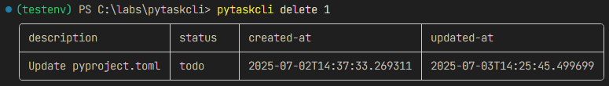
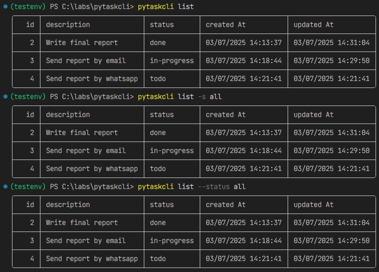
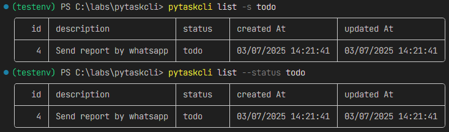

# PyTaskCLI: CLI ToDo App

## Description

PyTaskCLI is a command-line task tracker written in Python used to track and manage your tasks. Add, update, list, and manage your tasks through an intuitive CLI, powered by Python's built-in tools and best practices.

---

## Features

The application is run from the command line, accept user actions and inputs as arguments, and store the tasks in a JSON file. The user is able to:

- **Add Task**: Add a new task to your task list provided a description. Each task is given a unique ID and is initially set to "todo".
- **Update Task**: The description of an existing task can be updated. This requires the task's ID and the new description.
- **Delete tasks**: Tasks can be removed from the list by specifying their unique ID.
- **Mark a task as in progress or done**: Tasks can be marked as "in-progress" or "done" by providing their ID.
- **List all tasks**: Users can list all tasks or filter them by status.
- **List all tasks by status:**: Users can list tasks by filter them by status. The statuses available for filtering are "done", "todo", and "in-progress".

## Project Structure

```pgsql
.
├── README.md
├── pyproject.toml
├── requirements-dev.txt
├── requirements.txt
├── .gitignore
├── src/
│   └── pytaskcli/
│       ├── __init__.py
│       ├── main.py         # Entry point
│       ├── cli.py          # CLI parser & dispatcher
│       ├── core.py         # Task logic (add, update, etc.)
│       ├── db.py            # Database (JSON file I/O)
│       └── utils.py         # Helpers (date formatting)
└── tests/
    ├── test_core.py
    ├── test_db.py
    ├── test_cli.py
    └── test_main.py
```

## Installation

### 1. Create and activate a virtual environment (optional)

```bash
python -m venv .venv

source .venv/bin/activate       # macOS/Linux

.venv\Scripts\activate          # Windows
```

### 2. Installation can be done via pip

```bash
pip install git+https://github.com/alessandroibes/pytaskcli.git
```

## How to Run the App

After installation, you can use the CLI tool directly:

```bash
pytaskcli <command> [options]
```

## Usage Examples

### Add a task

```bash
pytaskcli add "Write final report"
```


### Update a task

```bash
pytaskcli update 1 "Update README"
```


### Delete a task

```bash
pytaskcli delete 2
```



### Mark a task as in-progress

```bash
pytaskcli mark-in-progress 2
```


### Mark a task as done

```bash
pytaskcli mark-done 2
```


### List all tasks

```bash
pytaskcli list

# Other options
pytaskcli list -s all
pytaskcli list --status all
```



### List tasks by status

```bash
# Status: todo
pytaskcli list -s todo
pytaskcli list --status todo
```



```bash
# Status: in-progress
pytaskcli list -s in-progress
pytaskcli list --status in-progress
```


```bash
# Status: done
pytaskcli list -s done
pytaskcli list --status done
```

